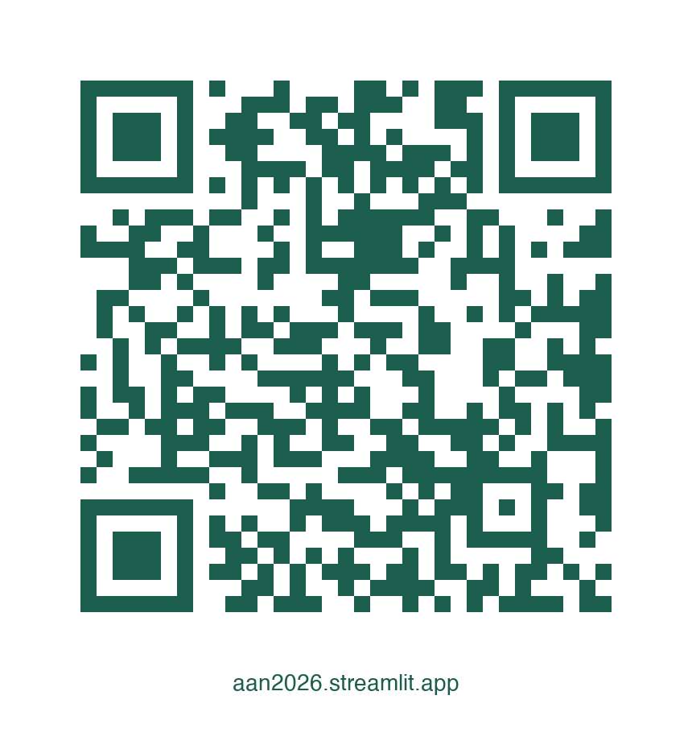

# MoCA Subtyping Interactive Explorer

Companion web app for the AAN 2026 poster:
**"MoCA Uses Beyond MCI Screening: Data-Driven MoCA Score-Based Subtypes for Prediction of Dementia Outcomes and Neuroimaging Feature Analysis"**

Bhukdee et al. | Chulalongkorn University, Bangkok, Thailand

**Live app:** [aan2026.streamlit.app](https://aan2026.streamlit.app/)



## Quick Start

```bash
cd mci-subtyping-app
pip install -r requirements.txt
streamlit run app.py
```

## Deploying to Streamlit Community Cloud

1. Push this folder to a GitHub repo
2. Go to [share.streamlit.io](https://share.streamlit.io)
3. Connect the repo, set `app.py` as the main file
4. Deploy

## Data

All data in `data/` is **pre-computed aggregate summaries only** — no individual-level ADNI data.

- `pathway_info.json` — Static pipeline constants (tier definitions, pathways, color palettes)
- `domain_profiles.json` — Median/IQR domain scores per subtype (from clustering output)
- `demographics.json` — Aggregate demographics per subtype (requires export script on cuaim)
- `transition_matrix.json` — Annual transition probabilities (requires export script)
- `sojourn_times.json` — KM sojourn times per subtype (requires export script)
- `survival_curves.json` — KM curve coordinates (requires export script)
- `cox_results.json` — Hazard ratios per model (requires export script)
- `cindex_results.json` — C-index comparison (requires export script)
- `rfecv_accuracy.json` — RFECV balanced accuracy per modality (requires export script)
- `figures/` — Pre-rendered pipeline figures (PNG)

## Generating Additional Data

Some data files require running the export script with access to ADNI data:

```bash
cd cascade_moca_pipeline
export MOCA_DATA_DIR=/path/to/adni/data
export MOCA_RESULTS_DIR=/path/to/precomputed/results
python scripts/export_for_app.py
```

Then copy the generated JSON files to this app's `data/` directory.

## ADNI Data Use Agreement

This app contains **no individual-level ADNI data**. All values are aggregate statistics
(means, medians, percentages). No PTID, RID, or
identifiable information or individual-level data is included.

## AI Assistance

Claude (Anthropic, Opus 4.6) was used for assistance with code debugging and language editing. The authors reviewed and take full responsibility for all content. No participant-level data from ADNI or KCMH was shared with any AI tool, in compliance with the ADNI Data Use Agreement.